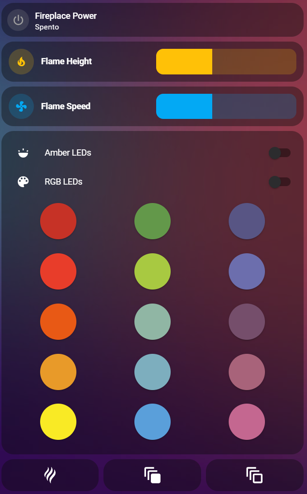

# AFIRE Fireplace Integration for Home Assistant

[](https://hacs.xyz)
[](https://www.home-assistant.io/)
[](LICENSE)

Control your AFIRE water vapor fireplaces directly in [Home Assistant](https://www.home-assistant.io/).
Official AFIRE website: [https://www.a-fireplace.com/](https://www.a-fireplace.com/)

## Disclaimer

This integration is an independent community project.
It is not affiliated with, endorsed by, or supported by AFIRE.

- Use at your own risk.
- AFIRE may change their cloud APIs at any time, which could break this integration.
- The integration is provided "as is" with no warranties.
- Please do not contact AFIRE support about this integration.

## Supported Series

This integration now supports both currently known AFIRE cloud API families:

- `AWPR`: the legacy Gizwits-based series supported by the original integration.
- `AWPR2`: the newer series using the `afire.winhui.com.cn` API.

One AFIRE account can contain fireplaces from both series, and the integration will try to discover all supported devices linked to that account.

## Supported Models

AFIRE fireplaces are currently handled as two capability variants:

- `PRESTIGE`: RGB-capable models with color presets and effects.
- `ADVANCED`: non-RGB models.

Current AWPR2 note:

- AWPR2 model detection is designed around `iotId`.
- Until the exact `iotId -> model` mapping is known from live devices, unknown AWPR2 devices are treated as `PRESTIGE` by default.
- Based on public AFIRE product information, this fallback is currently considered the safest assumption.
- This may temporarily expose RGB entities on some AWPR2 devices until the proper mapping is confirmed.

## Features

- Control fireplace power, flame height, and flame speed
- Switch Amber LEDs and RGB LEDs independently where supported
- Select preset RGB colors arranged like the physical remote
- Trigger lighting effects where supported
- Works with multiple fireplaces in one account
- Full integration with Home Assistant devices and areas
- Mixed-series discovery across both AWPR and AWPR2
- Strict-mode safety behavior:
  - If the fireplace is off, flame, LEDs, colors, and effects cannot be changed.
  - Commands are ignored and logged as warnings.

## Prerequisites

- Fireplaces must already be set up and working in the AFIRE mobile app.
- You need the AFIRE account credentials used in the mobile app.

## Installation

### Via HACS

1. Open HACS in Home Assistant.
2. Add this repository as a Custom Repository.
3. Install `AFIRE Fireplace`.
4. Restart Home Assistant.

### Manual

1. Copy the `custom_components/afire` folder into your Home Assistant configuration directory.
2. Restart Home Assistant.

Resulting structure:

```text
config/
  custom_components/
    afire/
      __init__.py
      manifest.json
      ...
```

## Setup

1. Go to `Settings -> Devices & Services -> Add Integration`.
2. Search for `AFIRE`.
3. Enter your AFIRE account credentials.
4. Home Assistant will discover all supported fireplaces linked to that account.
5. Assign each fireplace to the desired area.

## Entities Created

Entity IDs are based on the detected device identifier, which now includes the series prefix to avoid collisions between AWPR and AWPR2 devices.

| Entity Type | Example Entity ID | Friendly Name Example | Availability | Description |
|-------------|-------------------|-----------------------|--------------|-------------|
| `switch` | `switch.fireplace_power` | Fireplace Power | All supported devices | Main power on/off for the fireplace |
| `switch` | `switch.fireplace_amber_leds` | Fireplace Amber LEDs | Devices exposing amber side LEDs | Controls the amber side LED light bars |
| `switch` | `switch.fireplace_rgb_leds` | Fireplace RGB LEDs | RGB-capable devices only | Controls the RGB LED light bars |
| `number` | `number.fireplace_flame_height` | Fireplace Flame Height | All supported devices | Adjusts flame height |
| `number` | `number.fireplace_flame_speed` | Fireplace Flame Speed | All supported devices | Adjusts flame speed |
| `number` | `number.fireplace_brightness` | Fireplace Brightness | Devices exposing brightness control | Adjusts fireplace brightness |
| `light` | `light.fireplace_colors` | Fireplace Colors | RGB-capable devices only | Controls preset RGB colors and supported effects |

Notes:

- `AWPR` and `AWPR2` device IDs are internally prefixed differently, so mixed-series accounts can coexist safely.
- RGB entities should only appear for `PRESTIGE` devices.
- During the temporary AWPR2 fallback-to-prestige phase, some AWPR2 devices may still expose RGB entities until the correct `iotId` mapping is known.
- AWPR and AWPR2 do not expose exactly the same effect set today. AWPR supports `Smooth`, `Fade 1`, and `Fade 2`; AWPR2 currently exposes `Smooth`.

## Example Fireplace Remote UI Card

Here is an example dashboard layout that mimics the look and feel of the AFIRE remote control:



This layout uses Mushroom cards, RGB Light cards, and Buttons.

## Example Lovelace Configuration

The example below is most useful for an RGB-capable fireplace. If your fireplace does not expose RGB or effect entities, simply omit those cards.

```yaml
# Power switch
type: tile
entity: switch.fireplace_power
features_position: bottom
vertical: false
grid_options:
  columns: 12
  rows: 1
icon: mdi:power
hide_state: false

# Flame height
type: custom:mushroom-number-card
entity: number.fireplace_flame_height
name: Flame Height
layout: horizontal
icon_color: amber
icon: mdi:fire

# Flame speed
type: custom:mushroom-number-card
entity: number.fireplace_flame_speed
name: Flame Speed
layout: horizontal
icon_color: light-blue
icon: mdi:fan

# Optional brightness control
type: custom:mushroom-number-card
entity: number.fireplace_brightness
name: Brightness
layout: horizontal
icon_color: yellow
icon: mdi:brightness-6

# LEDs and color presets
type: entities
show_header_toggle: false
entities:
  - entity: switch.fireplace_amber_leds
    name: Amber LEDs
  - entity: switch.fireplace_rgb_leds
    name: RGB LEDs
  - type: custom:rgb-light-card
    entity: light.fireplace_colors
    size: 60
    justify: around
    colors:
      - rgb_color: [198, 50, 38]
      - rgb_color: [99, 152, 74]
      - rgb_color: [88, 85, 132]
  - type: custom:rgb-light-card
    entity: light.fireplace_colors
    size: 60
    justify: around
    colors:
      - rgb_color: [232, 61, 42]
      - rgb_color: [168, 201, 65]
      - rgb_color: [108, 110, 173]
  - type: custom:rgb-light-card
    entity: light.fireplace_colors
    size: 60
    justify: around
    colors:
      - rgb_color: [232, 89, 21]
      - rgb_color: [144, 182, 164]
      - rgb_color: [117, 78, 107]
  - type: custom:rgb-light-card
    entity: light.fireplace_colors
    size: 60
    justify: around
    colors:
      - rgb_color: [232, 154, 41]
      - rgb_color: [125, 174, 190]
      - rgb_color: [168, 99, 122]
  - type: custom:rgb-light-card
    entity: light.fireplace_colors
    size: 60
    justify: around
    colors:
      - rgb_color: [249, 234, 37]
      - rgb_color: [90, 159, 218]
      - rgb_color: [196, 103, 144]

# Effects
type: horizontal-stack
cards:
  - type: button
    show_name: false
    icon: mdi:scent
    tap_action:
      action: call-service
      service: light.turn_on
      target:
        entity_id: light.fireplace_colors
      data:
        effect: Smooth
    icon_height: 40px

  - type: button
    show_name: false
    icon: mdi:animation
    tap_action:
      action: call-service
      service: light.turn_on
      target:
        entity_id: light.fireplace_colors
      data:
        effect: Fade 1
    icon_height: 40px

  - type: button
    show_name: false
    icon: mdi:animation-outline
    tap_action:
      action: call-service
      service: light.turn_on
      target:
        entity_id: light.fireplace_colors
      data:
        effect: Fade 2
    icon_height: 40px
```

## Series-Specific Notes

### AWPR

- Uses the legacy Gizwits cloud API.
- Continues to behave like the previous integration versions.
- RGB-capable AWPR devices currently expose the richest effect support in the integration.

### AWPR2

- Uses a different API host and a command-based control model.
- State is derived from the returned `open_state` value.
- The integration applies optimistic Home Assistant updates, then validates the state with a delayed refresh.
- AWPR2 support was implemented from API documentation and public product/app information, not yet validated against a real device.
- The current online research suggests AWPR2 is very likely the RGB-capable product family, which makes the current default-to-`PRESTIGE` behavior more defensible.

## Roadmap

- Validate AWPR2 support against a real device
- Add the exact AWPR2 `iotId -> model` map
- Improve effect and color state synchronization
- Investigate local control options

## Credits

- Built by the community for the community
- Inspired by the AFIRE remote and app

## License

This project is licensed under the [MIT License](LICENSE).
